# SUSTech_CS202_CPU

## Introduction

The project implemented a single-cycle CPU based on the Minisys instruction set architecture, and achieved an elegant user interaction experience through device pins such as switches, led lights, seven-segment digital display tubes, and uart interfaces on the FPGA development board.

### Grouping

- 12011543 林洁芳：Basic function modules, Test 1,  part of Test 2
- 12011411 吴笑丰：Top module, IO module, Uart module
- 12011906 汤奕飞：Design and debugging of Test 2

### Implementation

- Implemented all the instructions in Minisys Instruction Set Architecture.
- Implemented UART interface to allow loading different programs (`.coe` files) to the CPU for execution without re-programming the bitstream file to the FPGA chip.
- Implemented the use of multiple IO devices to enable users to interact with the CPU.

### I/O Devices

- 5 $*$ buttons + 1 $*$ reset button
- 8 $*$ 7-segment digital tubes
- 24 $*$ switches
- 24 $*$ LEDs

### Data Segment

| Address                     | Stroage                                                  |
| --------------------------- | -------------------------------------------------------- |
| `0x00000000` - `0x00010000` | instructions in `.text` label and data in `.data` label |
| `0xFFFFFC40` - `0xFFFFFC42` | 7-segment digital tubes’ data                            |
| `0xFFFFFC50` - `0xFFFFFC53` | data of `button[4:0]`                                    |
| `0xFFFFFC60` - `0xFFFFFC63` | data of `LED[23:0]`                                      |
| `0xFFFFFC70` - `0xFFFFFC73` | data of `switch[23:0]`                                   |

- `0x00000000` - `0x00010000` ：RAM，stores instructions in `.text` label and data in `.data` label.
- `0xFFFFFC40` - `0xFFFFFC42`：Stores 7-segment digital tubes’ data.  `C40 - C41` is used to store 16 bits integer，the first 3 bits of `C42` is used to store 8 integer, showing the test statements.
- `0xFFFFFC50` - `0xFFFFFC53` ：Stores button data to determine whether the user has entered through IO.
- `0xFFFFFC60` - `0xFFFFFC63` ：Stores data of `LED[23:0]`.
- `0xFFFFFC70` - `0xFFFFFC73` ：Stores data of `switch[23:0]`.

## Modules Info

### Top Module

The top module of the whole CPU, instantiated and connected function modules and necesseary IP cores including Clocking Wizardc, Uart_bpmg_0, etc。

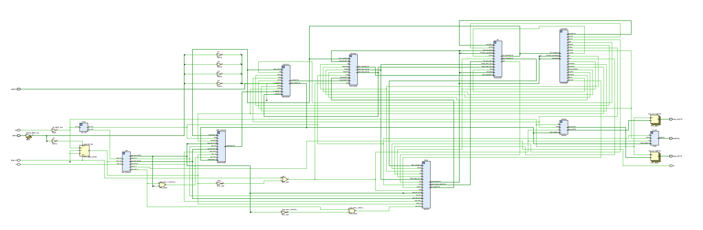

```verilog
module Top(
    input fpga_rst,
    input clk,
    input[23:0] sw,
    output[23:0] led,
    input[4:0] bt,
    output reg[7:0] seg_out,
    output reg[7:0] seg_en,
    //uart programmer pinouts
    input rx, //receive data by uart
    output tx //send data by uart
);
```

### IP Core

- Clocking Wizard

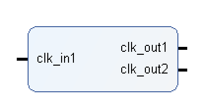

- Block Memory Generator * 2 

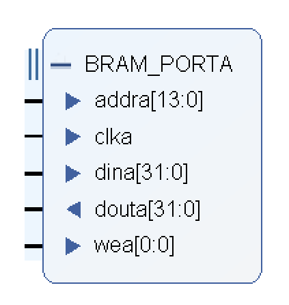

- Uart_bmpg_0

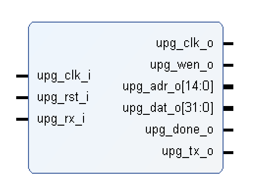

### Instruction Fetech Module

The module to fetch next instruction based on instruction memory cache and previous execution. 

- Instantiated a Block Memory Generator IP core as RAM to store instruction data.
- Add Uart pinouts to RAM IP core to implements the conversion between Uart transfer mode and normal mode.

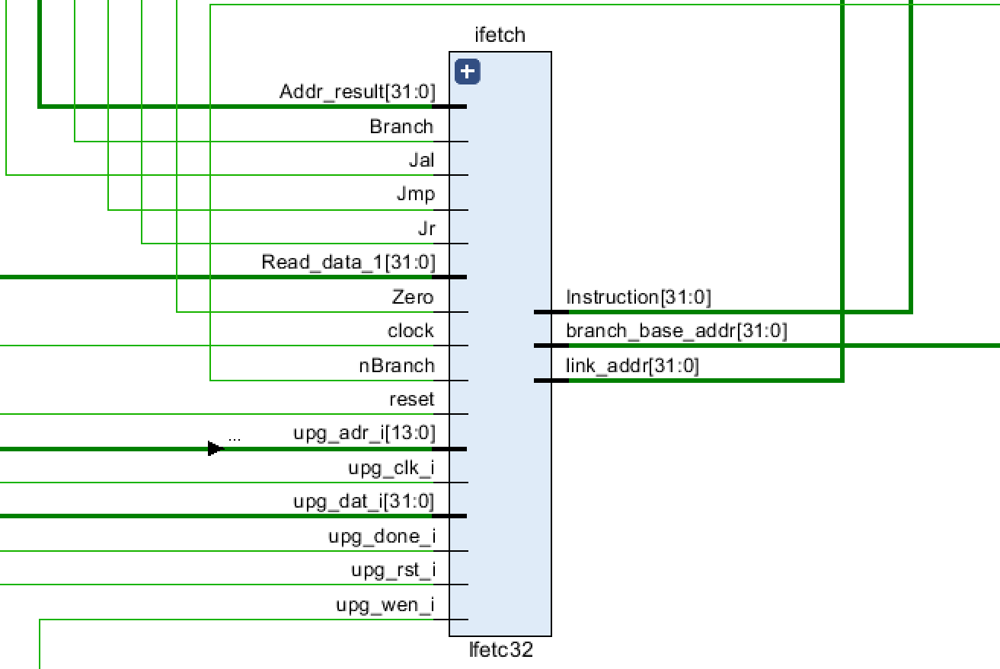

```verilog
module Ifetc32(
    output [31:0] Instruction,
    output [31:0] branch_base_addr,
    input [31:0] Addr_result,
    input [31:0] Read_data_1,
    input Branch,
    input nBranch,
    input Jmp,
    input Jal,
    input Jr,
    input Zero,
    input clock,
    input reset,
    output reg [31:0] link_addr,

    // UART Programmer Pinouts
    input upg_rst_i, // UPG reset (Active High)
    input upg_clk_i, // UPG clock (10MHz)
    input upg_wen_i, // UPG write enable
    input[13:0] upg_adr_i, // UPG write address
    input[31:0] upg_dat_i, // UPG write data
    input upg_done_i // 1 if program finished
);
    
    //RAM
    wire kickOff = upg_rst_i | (~upg_rst_i & upg_done_i );
    prgrom instmem (
    .clka (kickOff ? clock : upg_clk_i ),
    .wea (kickOff ? 1'b0 : upg_wen_i ),
    .addra (kickOff ? PC[15:2] : upg_adr_i ),
    .dina (kickOff ? 32'h00000000 : upg_dat_i ),
    .douta (Instruction)
    );
```


### Controller Module

The module to analyze instructions and transmit control signals to other function modules.

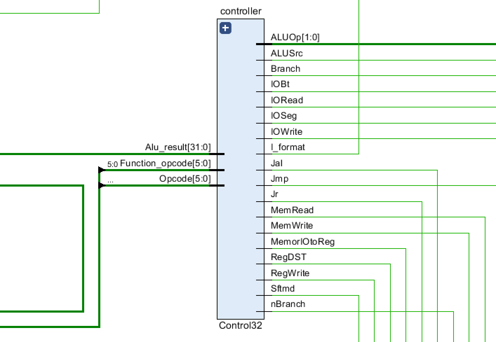

```verilog
module Control32(
    input [5:0] Opcode,
    input [5:0] Function_opcode,
    output Jr,
    output RegDST,
    output ALUSrc,
    output RegWrite,
    output MemWrite,
    output Branch,
    output nBranch,
    output Jmp,
    output Jal,
    output I_format,
    output Sftmd,
    output [1:0] ALUOp,
    input[31:0] Alu_result,
    output MemorIOtoReg,
    output MemRead,
    output IORead,
    output IOWrite,
    output IOBt,
    output IOSeg
);
```


### Decoder Module

The module to analyze instructions and get the data from the register, while writing data to register when necessary.

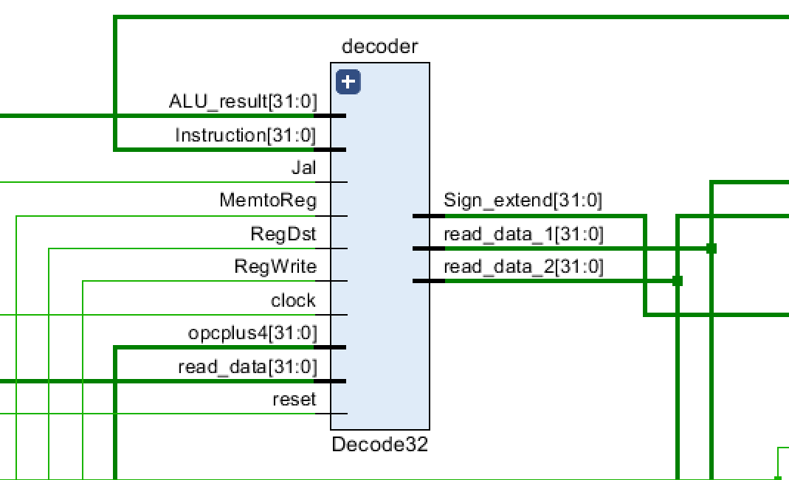

```verilog
module Decode32(
    output [31:0] read_data_1,
    output [31:0] read_data_2, 
    input [31:0] Instruction,
    input [31:0] read_data, //from mem or io
    input [31:0] ALU_result,
    input Jal,
    input RegWrite,
    input MemtoReg, // MemOrIOtoReg
    input RegDst,
    output [31:0] Sign_extend,
    input clock,
    input reset,
    input [31:0] opcplus4
);
```


### ALU Module

The module to do the actual calculation and get the results of the instructions.

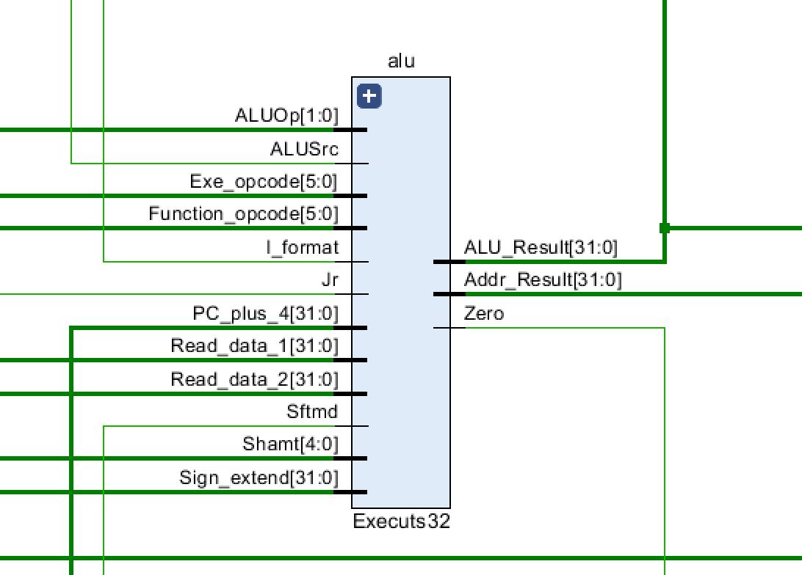

```verilog
module Executs32(
    input [31:0] Read_data_1,
    input [31:0] Read_data_2,
    input [31:0] Sign_extend,
    input [5:0] Function_opcode,
    input [5:0] Exe_opcode,
    input [1:0] ALUOp,
    input [4:0] Shamt,
    input Sftmd,
    input ALUSrc,
    input I_format,
    input Jr,
    output Zero, 
    output reg [31:0] ALU_Result,  //the ALU calculation result
    output[31:0] Addr_Result,
    input [31:0] PC_plus_4
);
```


### Data Memory

The memory to interact with data memory cache. Instantiaed a Block Memory Generator IP core as RAM to store and read instruction data.

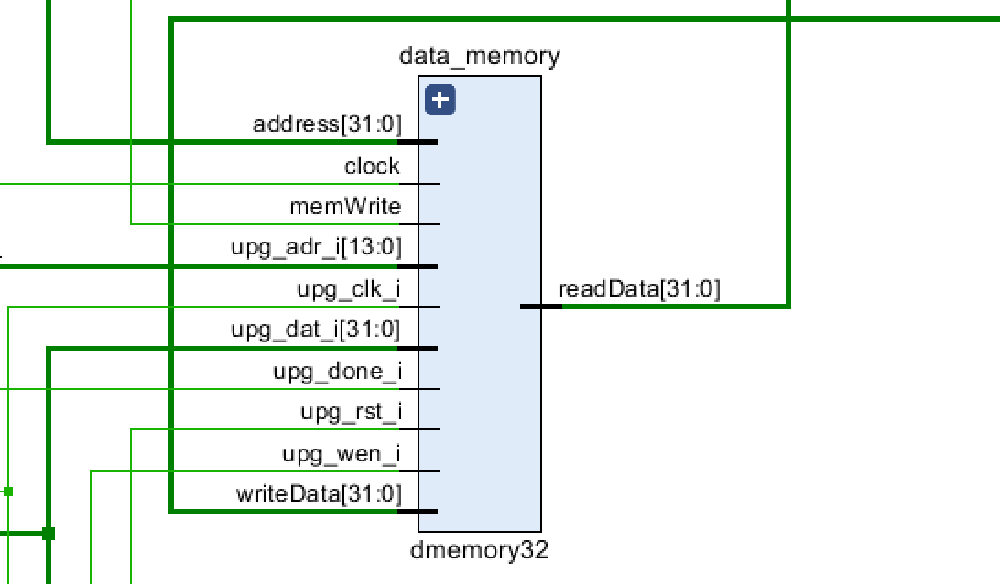

```verilog
module dmemory32(
    //memWrite comes from controller, 1'b1 -> write data-memory.
    input clock,
    input memWrite,
    input [31:0] address,
    input [31:0] writeData,
    output [31:0] readData,

    // UART Programmer Pinouts
    input upg_rst_i, // UPG reset (Active High)
    input upg_clk_i, // UPG ram_clk_i (10MHz)
    input upg_wen_i, // UPG write enable
    input [13:0] upg_adr_i, // UPG write address  upg_adr_o[14:1], ifetch [13:0]
    input [31:0] upg_dat_i, // UPG write data
    input upg_done_i // 1 if programming is finished
);
    
    //RAM
    wire kickOff = upg_rst_i | (~upg_rst_i & upg_done_i); 
    RAM ram (
    .clka (kickOff ? clk : upg_clk_i),
    .wea (kickOff ? memWrite : upg_wen_i),
    .addra (kickOff ? address[15:2] : upg_adr_i),
    .dina (kickOff ? writeData : upg_dat_i),
    .douta (readData)
    );
```


### MemoryOrIO Module

The module to determine the actual data that will be read from memory or input device, or written to memeory or ourtput device.

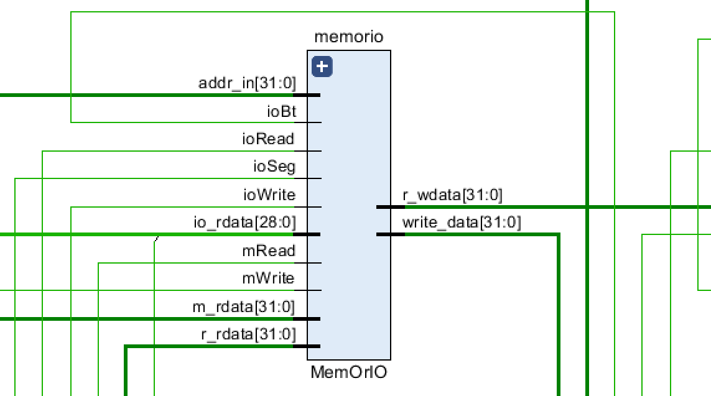

```verilog
module MemOrIO(
    input mRead,
    input mWrite,
    input ioRead,
    input ioWrite,
    input ioBt,
    input ioSeg,
    input [31:0] addr_in,
    input [31:0] m_rdata, //read from memory()
    input [28:0] io_rdata, //read from io
    input [31:0] r_rdata, //data read from register when sw
    output reg[31:0] r_wdata, //data write into register when lw
    output reg [31:0] write_data// write into memory or io
);
```


### Display Module

Two modules that show the data on the output devices.

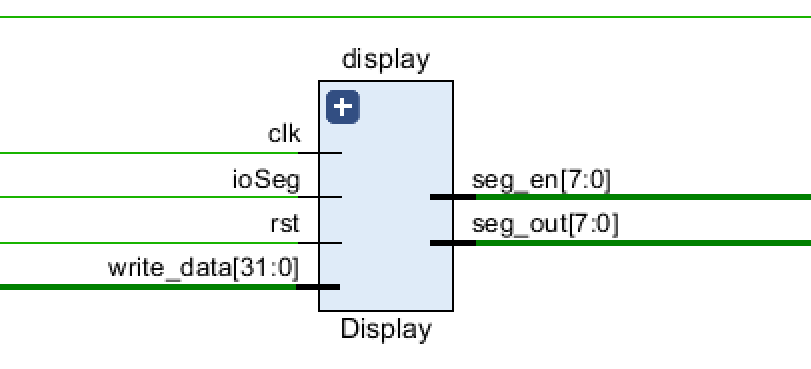

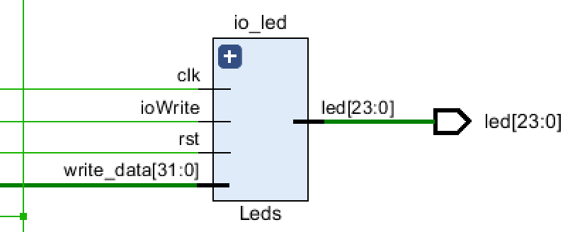

```verilog
// 七段数码管显示
module Display(
    input clk, rst,
    input ioSeg,
    input[31:0] write_data,
    output [7:0] seg_out,
    output [7:0] seg_en
);
    
// LED灯管显示
module Leds(
    input clk,
    input rst,
    input ioWrite,
    input[31:0] write_data,
    output reg[23:0] led
);
```


### Others

Primitive gate `BUFG` to de-twitter the input data.

```verilog
BUFG U1(.I(bt[1]), .O(bt_out[1]));
BUFG U2(.I(bt[2]), .O(bt_out[2]));
BUFG U3(.I(bt[3]), .O(bt_out[3]));
BUFG U4(.I(bt[4]), .O(bt_out[4]));
```


## Tests

### IO Method

To input several data, the button signal is used and processed in the assembly.

```mips
initialization:
	lui $1, 0xFFFF			
	ori $28, $1, 0xF000
	
# loop while button signal is 0. used to wait for button signal.
bt_0:   
	lw $t0, 0xC50($28)
	beq $t0, $zero, bt_0
	
# loop while button signal is 1. used to eliminate button signal.
bt_1:
	lw $t0, 0xC50($28)
	bne $t0, $zero, bt_1
	
	#load word
	lw $s1, 0xC70($28)
```


### Basic Test

- *IO Test* (given by materials): uses `lw` and `sw` to check I/O module.
- *Add Test*：checks loading several data one by one based on buttons.
- *Memory Test* : checks whether `sw` can store data into data memory. 
- *Light Test* : used to show Uart function and appreciate sister WeiWei.

### Test 1

简单说明一下整体逻辑？

### Test 2


## Problems and Solutions

### git 仓库同步问题

注意到 vivado 在运行时会生成许多文件，尤其在每个ip核内都会更新对应的 `.xml` 文件，记录下 `.coe` 文件的路径。可能是由于该问题，导致如果这些本地记录的配置被同步到远端以后，其他人 pull 以后会出现路径相关的问题。基于以上种种原因，我们在 git 仓库中添加了以下 `.gitignore` 文件：

```gitignore
## dirs
CPU.cache/
CPU.hw/
CPU.ip_user_files/
CPU.runs/
CPU.sim/
```

### 时钟 ip 核问题

在按照课件配置时钟 ip 核以后，发现在 implementation 过程中出现了以下错误:

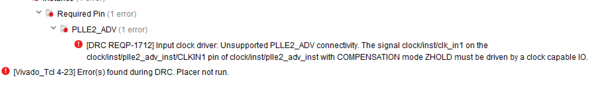


查阅相关资料后，将时钟来源从更改为了 `Global buffer`。

参考：https://blog.csdn.net/qq_39507748/article/details/115909998